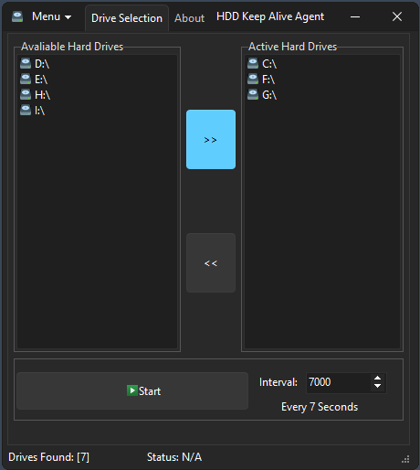

<h1>Delphi HDD Keep Alive Agent</h1>

This Delphi VCL application allows you to keep selected hard drives (HDDs) active by writing a small <code>ping.txt</code> file to them periodically. The user can select the drives to monitor and configure the time interval for writing the file, preventing the drives from spinning down due to inactivity. (And if your worried about clutter... WORRY NOT the software always cleans the text files from the drives as well so you have no leftover's to worry about.)

<!-- Replace 'Preview.gif' with the path to your actual image file -->

  

<h2>Features</h2>
<ul>
  <li><strong>Keep Drives Spun Up:</strong> Prevent your HDDs from spinning down by writing a <code>ping.txt</code> file at regular intervals.</li>
  <li><strong>Drive Selection:</strong> Easily select which drives you want to monitor from the user interface.</li>
  <li><strong>Custom Interval:</strong> Set the time interval between file writes (in seconds).</li>
  <li><strong>Simple GUI:</strong> Easy-to-use interface to configure drive selection and timing.</li>
</ul>

<h2>Installation</h2>
<ol>
  <li><strong>Download & Extract:</strong> Download the project files and extract them to your local machine.</li>
  <li><strong>Open Delphi Project:</strong> Open the <code>.dpr</code> file in the Delphi IDE.</li>
  <li><strong>Compile:</strong> Build the project to generate the executable.</li>
  <li><strong>Run:</strong> Execute the application to start using the agent.</li>
</ol>

<h2>Usage</h2>
<ol>
  <li><strong>Select Drives:</strong> Use the interface to select which drives you want to monitor.</li>
  <li><strong>Set Interval:</strong> Configure the time interval (in seconds) between writing the <code>ping.txt</code> file to the selected drives.</li>
  <li><strong>Start/Stop:</strong> Start and stop the keep-alive process directly from the interface.</li>
</ol>

<strong>Note:</strong> Make sure the <code>ping.txt</code> file can be written to the selected drives, and ensure you have the necessary permissions to do so.

<h2>Contributing</h2>

Contributions are welcome! If you have suggestions or bug fixes, please fork the repository and submit a pull request.

<h2>License</h2>

This project is provided "as is" without warranty. Use it at your own risk.

<h2>📧 Contact</h2>

Discord: bitmasterxor

Made with ❤️ by: BitmasterXor, using Delphi RAD Studio

